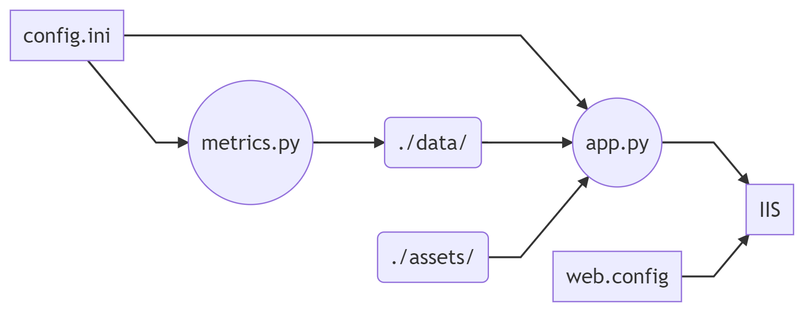
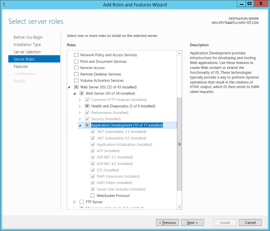
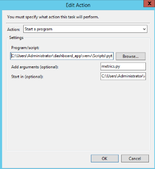

# Dashboard Installation, Integration with Content Manager, and Deployment with IIS
All the in-depth information on installation, from downloading and setting up Python to connecting & deploying with IIS.

## Python Setup
This dashboard is built with Plotly's Dash, and at its core requires only Python :snake:. If you already are already familiar with Python you can skip most of these steps, but it might be worth a skim make sure that you have all the dependencies installed (... & that you know where they are installed, because we'll need that later).

1. Clone this repository by running `git clone https://github.com/Info-First/dashboard_app.git`. If you don't have git and would prefer not to go down that rabbit hole, click 'Download Zip File', move it to a directory of your choosing, and unzip. If it is nested (eg, _dashboard_app-master/dashboard_app_) move _/dashboard_app_ outside and delete _/dashboard_app-master_.
2. Make sure you have Python 3.6+ installed. If you don't you can [download Python here](https://www.python.org/downloads/). When installing, follow all the default instructions but also check the 'Add to PATH' box. After the installer finishes, you can check that it is good to go by opening Windows PowerShell (just search "Powershell" into windows search) and then typing `python --version`: it should spit out something like 'Python 3.X.xx'.  
3. Once you have python installed, create a virtual environment to install all your dependencies in. If you're familiar with virtual environments feel free to to use the one of your choice, otherwise we'll use _virtualenv_. First, navigate to your _dashboard_app_ folder (either within PowerShell via `cd`, or navigate to the folder with the File Explorer > File > Windows Powershell Here). Install virtualenv by running `pip install virtualenv`, and check it is installed with `virtualenv --version`. Once it's installed, run `virtualenv venv` and finally `venv\Scripts\activate` to activate the environment. You can tell it's installed because you should see _(venv)_ in front of your command line. For a more in depth explanation of virtualenv (and other options) see the [hitchhikers guide](https://docs.python-guide.org/dev/virtualenvs/) 
4. Now that your virtual environment (_venv_) is activated, run `pip install -r requirements.txt` to install all the dependencies into the _venv_ folder. 
5. Run `python app.py` and then go to `http://127.0.0.1:8050/` in your browser to get an idea what your dashboard will look like (the _./data_ folder comes with generated data and _config.ini_ has some initial preconfigured options -- you will update and replace both). To shutdown the dashboard, enter _CTRL_ + _C_ within Powershell. 

## Configuration & Content Manager Connection

With Python and all the project's dependencies installed, next, we have to configure _config.ini_ to connect to your Content Manager dataset (for which we'll need access to MS SQL Server and the CM Service API) and make customization of your dashboard easier. 

As the diagram above (used to, _config.ini_ is used by _metrics.py_ (the connection with your MS SQL Database) and _app.py_ (what generates your dashboard). Alter _config.ini_ like so:

_metrics.py_
- `driver` - the MS SQL server product. Among others, this is _SQL Server_ if your Server Product is MS SQL Express, or _SQL Server Native Client 11.0_ if your Server Product is MS SQL Standard. You can find out which one [here](https://github.com/mkleehammer/pyodbc/wiki/Connecting-to-SQL-Server-from-Windows). 
- `server` - this is specific to your MS SQL Server, you should see it right when you open up SQL Management Studio
- `database` - the name of the Database, should match the name of the CM dataset (does not need to include _.dbo._)
- `active_timeframe` - the number of years backward from today, as an integer, you would like to limit your dashboard to. Leaving commented out will pull everything, setting to `1` will pull a single year, etc. 
- `service_api_url` - something like http://localhost/CMServiceAPI/, check your CM Documentation
- `service_api_auth_method` - 'anonymous' or 'windows', based on your IIS ServiceAPI authentication setting.

_app.py_
- title - to replace 'Default Title' at the top of the screen. 
- base_chart_color - hex string that you would like all one color graphs to be 
- color_palette_categorical = hex strings separated by spaces to use for categorical graphs #f76c5e #233d4d #5eb1bf #324376 #7b5e7b #f4e04d #fe7f2d
- color_palette_gradient = two hex strings separated by spaces for use in gradient color graphs, eg #b2d8ff #00264c
	
Run `python metrics.py` to test that your settings from _config.ini_ work and you can access your CM dataset. With a large dataset it may take several minutes, but after the final "Success" message has been printed, you should see that inside of the /data/ folder all the files have been updated. If they haven't, check the output in Powershell & adjust config.ini accordingly.

Replace the logo located in `assets` with one of your choosing, renaming it to _logo.png_ (convert a .jpg to .png if necessary), as well as `favicon.ico` (keep the same name)

## Test your Dashboard with Flask
With PowerShell, navigate to your your _dashboard_app/_ directory and run `python app.py`. If everything is working correctly, you should get a message like the one below: 

	Dash is running on http://127.0.0.1:8050/

	 Warning: This is a development server. Do not use app.run_server
	 in production, use a production WSGI server like gunicorn instead.

	 * Serving Flask app "app" (lazy loading)
	 * Environment: production
	   WARNING: This is a development server. Do not use it in a production deployment.
	   Use a production WSGI server instead.
	 * Debug mode: on

You can ignore the warning; we'll take care of it in the next section on deploying with IIS. If instead of this message you get an error, double check that a) metrics.py ran correctly and all the data has updated b) config.ini is setup correctly. Once everything is running, navigate `http://127.0.0.1:8050/` in your browser (preferably Google Chrome) to see your updated dashboard. You can stop the dashboard from running by `CTRL` + `c` or `CTRL` + `UP ARROW` in PowerShell.

## Deploying with IIS

Now that you've set up different components of your dashboard and tested that it works with Flask's built-in development server, its time to deploy with a production server. To allow for use of Windows authentication and integration within SharePoint, we recommend setting up your dashboard for deployment with IIS. However, if you would like your dashboard to be publicly available, a good option is *Heroku*, as it's a simpler installation and the instructions can be found in the [Dash documentation](https://dash.plotly.com/deployment). Another option if you are the only one who normally views the dashboard but would like to occasionally share it with others is [ngrok](https://ngrok.com/).

### 1. Configuring Internet Information Services (IIS)

- Open Server Manager and make sure that you have [CGI installed within IIS](https://docs.microsoft.com/en-us/iis/configuration/system.webserver/cgi)

- Once CGI is installed, open IIS. On the left-hand side of the screen there is a _Connections_ column with your servers listed under it. Click on your server to expand, then right-click on _Sites_ > _Add Website_. Under _Site name:_ enter what you want to display your default website, eg http:\\base_url\VIRTUAL_NAME. For _Application Pool:_ use the one that gets created to match the site name. Under _Content Directory_ > _Physical path:_ click _..._, navigate to your dashboard_app location and click _OK_. Under _Binding_ > _Port:_ enter an unused port number. The rest of the options can be left as is, so click _OK_ to create your new site. 

### 2. Outside IIS

#### wfastcgi Setup
With Windows Powershell, double check that you are in your _dashboard_app_ folder and your virtual environment is activated (if not, run `venv\Scripts\activate`). When you initially ran `pip install -r requirements.txt`, this should have installed wfastcgi, a module for interfacing with IIS--if for some reason you didn't, you'll want to run `pip install wfastcgi` now. Run `wfastcgi-enable`, which should spit out: 

	Applied configuration changes to section "system.webServer/fastCgi" for "MACHINE
	/WEBROOT/APPHOST" at configuration commit path "MACHINE/WEBROOT/APPHOST"
	C:\WHERE_YOU_PUT_DASHBOARD_APP\dashboard_app\venv\scripts\python.exe|c:\WHERE_YOU_PUT_DASHBOARD_APP\dashboard_app\venv\lib\site-packages\wfastcgi.py" can now be used as a FastCGI script processor

Except that `C:\WHERE_YOU_PUT_DASHBOARD_APP` would be different based on your machine's setup; for example it might be something like`C:\users\administrator`.

If you run into an error about lacking permissions when you run `wfastcgi-enable`, this is most likely because you have already run the command or a FastCGI application with the same paths wfastcgi is trying to set already exists within IIS. To fix this, in IIS click on your server, FastCGI settings, remove the applications listed there with the same name as your path, and then try again.

_Now that you have registered wfastcgi at the __server level__, it's time to create web.config, which works at the __site level__._

In the text editor of your choosing, create web.config and paste in the following snippet, replacing WHERE_YOU_PUT_DASHBOARD_APP. 

	<configuration>
		<system.webServer>
			<handlers>     
			<add name="Python FastCGI" path="*" verb="*" modules="FastCgiModule" 	scriptProcessor="C:\WHERE_YOU_PUT_DASHBOARD_APP\dashboard_app\venv\scripts\python.exe|C:\WHERE_YOU_PUT_DASHBOARD_APP\dashboard_app\venv\lib\site-packages\wfastcgi.py" resourceType="Unspecified" requireAccess="Script" />   
			</handlers> 
		</system.webServer>
			<appSettings>  
			<!-- Required settings -->    
			<add key="WSGI_HANDLER" value="app.server" />    
			<add key="PYTHONPATH" value="C:\WHERE_YOU_INSTALLED_DASHBOARD_APP\dashboard_app" />   
			
			<!-- Optional settings -->    
			<add key="WSGI_RESTART_FILE_REGEX" value=".*((\.csv)|(\.py)|(\.config))$" />
		</appSettings>
	</configuration>

#### Access
In order for IIS to serve up your dashboard *app.py* with python, it must be granted permissions that allow it to access both python.exe and wfastcgi.py. 
You'll need run the following icacls commands (one line at a time) in two separate places: 
- Wherever you installed dashboard_app; this will grant permissions to wfastcgi.py because it is located in the venv subfolder
- Where your base python.exe is installed. To find this run `python -m site`; this will spit out a list of a bunch of different directories. You'll want the one most similar `c:\\users\\administrator\\appdata\\local\\programs\\python\\python38-32`. Go to this directory and check that you see python.exe there; if it is great, if not, check out some of the other ones.

	`icacls . /grant "NT AUTHORITY\IUSR:(OI)(CI)(RX)"`

	`icacls . /grant "Builtin\IIS_IUSRS:(OI)(CI)(RX)"`

### 3. Back to IIS
Make sure to create a FastCGI application for the _Python FastCGI_ executable listed in Handler Mappings: Double click on the _Python FastCGI_, click _Request Restrictions_, make sure that box is unchecked, click 'Okay' > 'Okay' then 'Yes' when it asks you if you would like to create the application. 

If you receive an error that says "The specified executable does not exist on the server" this is likely because you have incorrectly specified the location of python.exe or wfastcgi in the string passed to scriptProcessor _web.config_. First check for any typos, then double check that the paths are correct by running `python where` to find the location of your virtual environment python executable, and look into dashboard_app\venv\lib\site-packages and double check that wfastcgi.py is located there.

Click on your site again on the left hand side to pull up the IIS home page. On the right hand side under 'Manage Website' click either 'Start' or 'Restart', then under Browse Website click 'Browse' (will probably have :SOME_PORT_NUMBER after it). You should see your a dashboard app that looks similar to the one you saw when you ran `python app.py`, only now it is running on a production ready server and can be setup to handle windows authentication, integrate with SharePoint, etc.

## Putting metrics.py on a Schedule with Windows Task Scheduler

Now that we _metrics.py_ working correctly and IIS serving up _app.py_, the final step is to setup refreshing / pulling the data regularly. We'll use Windows Task scheduler to run _metrics.py_ at a time interval of your choosing (daily, weekly, monthly, etc). __[Data to Fish produces a great guide on how to set this up and I highly suggest you follow it](https://datatofish.com/python-script-windows-scheduler/)__. However, if you would rather stay here, the steps are as follow: 
1. In the Windows Start Menu, search for 'Task Scheduler' and click on the App that looks like an orange clock.
2. On the right hand side under _Actions_, select _Create Task..._
3. Under _General_, name it something like 'Run Metrics.py for Dashboard App' and choose running permissions (if you want it run overnight when you aren't logged in, most likely 'Run whether the user is logged on or not' or 'Run with the highest privileges'). Go to the _Actions_ tab, and click _New..._. In the window that opens, leave the action as 'Start a program', and under _Settings_ > _Program/script:_ >_Browse..._ navigate to your dashboard_app directory > venv > scripts > select __python.exe__.  For _Add arguments(optional):_ put in __metrics.py__, and for _Start in (optional):_ enter the full location of your dashboard_app directory. It should look something like: 

4. Before you schedule the task to run regularly, it's good to test that you have everything up correctly: click _OK_ until you are back on the main Task Scheduler window. Select the task you just created and on the right hand side under _Selected Item_ click _Run_. The command prompt should open and you should see the metrics.py script running; depending on how big your dataset is this could take several minutes. Check that the files in ./dashboard_app/data are updated; if they haven't, double check that all the directories are correct. 

5. Once everything is working, go back to the task by clicking _Properties_ under _Selected Item_ on the right hand side. Go to to the _Triggers_ tab, click _New..._ and select how often / when you would like it to run (it's worth doing a test for a few minutes away and checking that it works correctly, and then setting the actual time that you would like it to run). 

 That's it, your dashboard is up, running, and scheduled to stay up to date. __Huzzah!__

## Stuck? Here are some Resources 

In the process of setting up Dash with IIS and writing this guide, many guides & forum posts came in handy. If you have gotten stuck, they may help you out as well.

__IIS__
- [Explanation of Setting up IIS with Dash, Including User Access Settings ](https://developpaper.com/using-iis-to-deploy-flask-website-on-windows-platform/)
- [Setting Up IIS using GUI](https://medium.com/@bilalbayasut/deploying-python-web-app-flask-in-windows-server-iis-using-fastcgi-6c1873ae0ad8)

__Plotly__
- [Getting Started](https://plotly.com/python/getting-started/)
- [Super In-Depth Explanation of Plotly's Graph Internals](https://plotly.com/python/figure-structure/)
- [Plotly Forum](https://community.plotly.com/)

___Dash___
- [Getting Started](https://dash.plotly.com/installation)
- [Setting up server = server.app within app.py](https://community.plotly.com/t/solved-dash-on-iis-8-typeerror-dash-object-is-not-callable/5787/3)
- [Setting your dash environment variables within web.config](https://community.plotly.com/t/solved-deploy-dash-on-iis-error/5434/5)
- [Dash Forum](https://community.plotly.com/c/dash/16)
